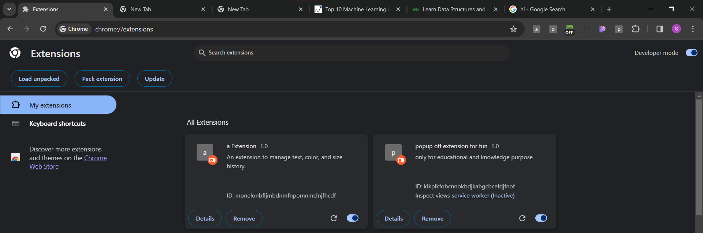
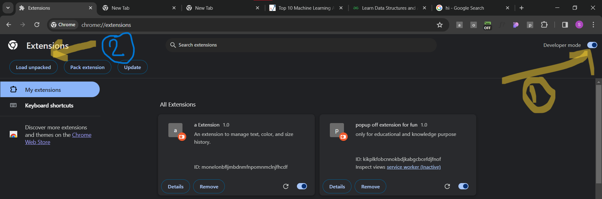
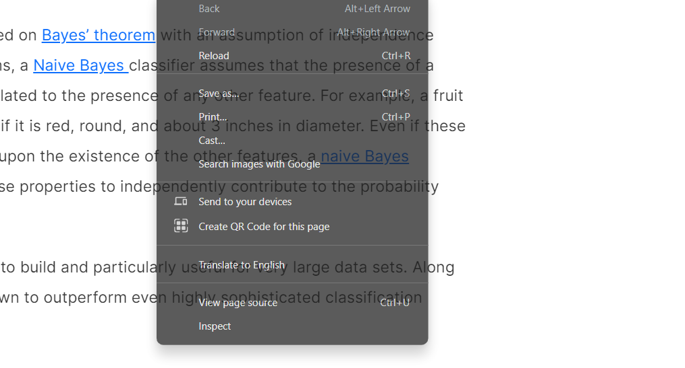
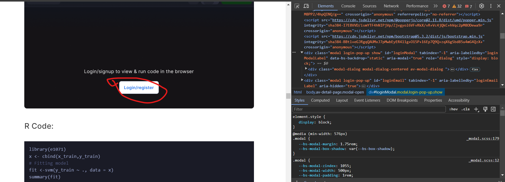

# pop_up_off_chrome_extension
only for educational and knowledge purpose,

it is just for fun,

# how_TO_USE

## first git clone this to any folder,
then 
just type in url = 
## "chrome://extensions/"
and enter 
and then on left side ,there is developer mode ,click on that 
you can also see image as below

### you can follow step from the image

now after loading ,you can pin that chrome extension and now whenever you are on any site you can click on this extension and it will be active for that screen

now one thing more ,using this will make you able to read the content but may be you will not be able to click on any its link for to do that ,for to allow clickable ,just inspect and click on the screen then there will be one class in elements that will glow on clicking over screen or any link ,just add there one line
for better understanding ,see image

,right click on the screen you will get inspect options do that and then follow as in screen and as written in readme.md

image for inspection 1.

2.

3.

4.

## dispaly: none 

and done ,now you will be able to click on link as well

: )

just for fun